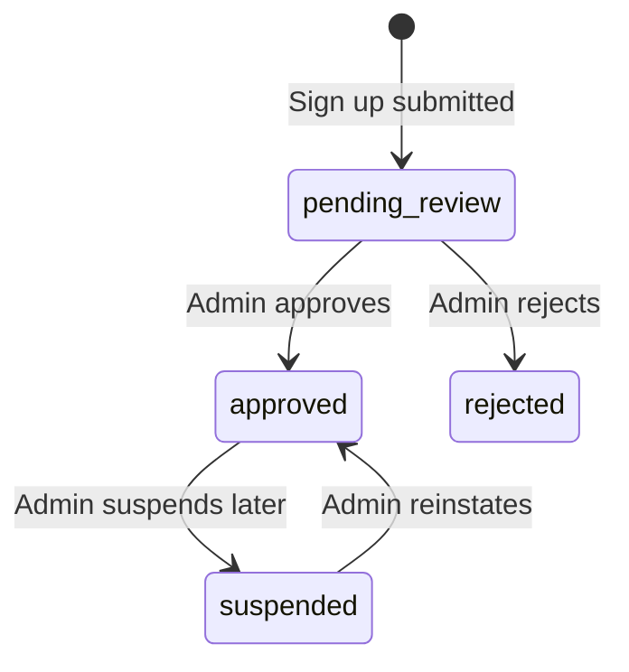
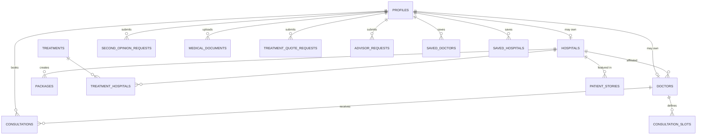
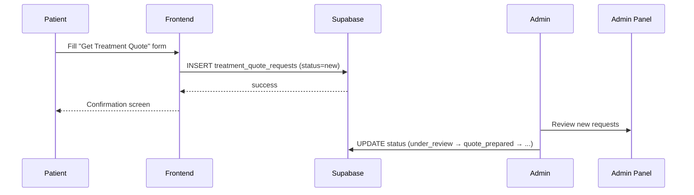
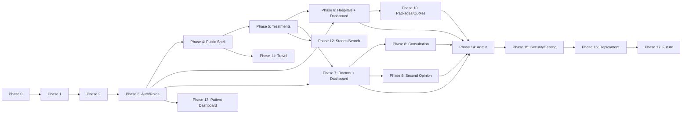

# International Healthcare Platform — Implementation Plan

**Master blueprint for Antigravity (AI coding agent). Beginner-friendly, Supabase-centric, React + Vite + Tailwind.**

---

## 1. Executive Summary

We are building a premium, trustworthy international healthcare / medical-tourism platform that helps international patients discover treatments, hospitals and doctors in India, get quotes and second opinions, book video consultations, and plan travel (flights, hotels, medical visa).

This is **not** a clone of MediGence or HealthTürkiye — those are UX/structure references only. Our product has its own branding, database, and four distinct account types: **Patient, Doctor, Hospital, Admin.**

The first release is a **professional MVP**: real auth, a real database, and real workflows — but no AI, no custom video infrastructure, no payment gateway, no booking engines for flights/hotels.

---

## 2. Product Vision & Core Principles

> International Patient → Discover → Compare → Consult → Plan → Travel → Treatment

Non-negotiable principles (Antigravity must respect these in every phase):

| # | Principle |
|---|---|
| 1 | This is a healthcare platform, not a travel site. Trust > visual gimmicks. |
| 2 | No unverified medical claims. Use "estimated / may vary / subject to medical evaluation." |
| 3 | Patient medical documents are sensitive — private storage + RLS, always. |
| 4 | Supabase is the **only** backend. No Node/Express/Django/FastAPI/custom auth server. |
| 5 | External travel services (flights/hotels) are **linked to**, never rebuilt. |
| 6 | AI is a future phase. Do not add any AI/chatbot feature now. |
| 7 | Doctors and Hospitals self-manage their own public data, but nothing goes live without **admin approval**. |
| 8 | Demo/seed data must be clearly separated from real verified data. |
| 9 | The MVP must stay understandable to a beginner developer. |
| 10 | UI must feel calm, premium, and positive — never childish, never cluttered. |

---

## 3. Roles & Target Users

Four account types, one `profiles` table, one `role` column:

| Role | Who they are | Has login? | Has dashboard? |
|---|---|---|---|
| **patient** | International patient / family member | Yes (self-signup) | Yes — bookings, requests, documents |
| **doctor** | A doctor listed on the platform | Yes (self-signup, needs approval) | Yes — manage profile, rates, availability |
| **hospital** | A hospital listed on the platform | Yes (self-signup, needs approval) | Yes — manage hospital profile, packages |
| **admin** | Platform operator | Yes (created manually in DB, no signup UI) | Yes — full oversight |

**Important distinction:** `doctors` and `hospitals` are *business entities* shown publicly on the marketplace. Each entity can optionally be *owned/managed* by a Supabase Auth user (via `profile_id`). Admin can also create doctor/hospital entities manually (no login) as seed data — those simply have `profile_id = null`.

---

## 4. Authentication & Sign-Up Flow (detailed)

### 4.1 Entry flow

```mermaid
flowchart TD
    A[Landing Page] -->|Click "Sign In"| B[Sign In / Sign Up Page]
    B --> C{Choose account type}
    C -->|Patient| D[Patient Sign-Up Form]
    C -->|Doctor| E[Doctor Sign-Up Form]
    C -->|Hospital| F[Hospital Sign-Up Form]
    B -->|Already have account| G[Login Form: email + password]
    D --> H[Supabase Auth signUp]
    E --> H
    F --> H
    H --> I[Trigger creates profiles row with role]
    E --> J[Also creates doctors row, status=pending_review]
    F --> K[Also creates hospitals row, status=pending_review]
    G --> L{Check role in profiles}
    L -->|patient| M[/dashboard/patient]
    L -->|doctor| N[/dashboard/doctor]
    L -->|hospital| O[/dashboard/hospital]
    L -->|admin| P[/admin]
```

**Note:** There is no "Admin" button on the sign-up screen. Only 3 buttons: **Patient / Doctor / Hospital**. Admin accounts are created by inserting a row directly into Supabase (`profiles.role = 'admin'`) for a specific email. Login is the same form for everyone — the app reads `role` after login and redirects.

### 4.2 Sign-up form fields (per role)

| Field | Patient | Doctor | Hospital |
|---|---|---|---|
| Full name / Hospital name | ✅ | ✅ | ✅ (hospital name) |
| Country | ✅ | ✅ | ✅ |
| Phone (with country code selector) | ✅ | ✅ | ✅ |
| Email | ✅ | ✅ | ✅ |
| Password | ✅ | ✅ | ✅ |
| Specialty / domain | — | ✅ | ✅ (multi-select: specialties/services offered) |

- Common **login form**: email + password only, for all roles.
- Country code + phone: use a simple dropdown/combo component (e.g. a small curated country list with dial codes), stored as two columns: `phone_country_code`, `phone_number`.
- **Email verification is disabled for MVP** (Supabase Auth → Settings → turn off "Confirm email"). Flag this clearly as a pre-production TODO in the security checklist — MVP-only decision, revisit before going live.

### 4.3 Approval workflow for Doctor / Hospital accounts

Because doctors and hospitals self-register, their public listing must not go live automatically:



- While `status = pending_review` or `rejected`, the doctor/hospital **can log in and edit their own dashboard**, but their profile is **not visible** on public pages.
- Only `status = approved` entities appear in public listings, search, and treatment/hospital pages.
- Admin dashboard has an approval queue for this.

### 4.4 What each dashboard can do

**Doctor dashboard (`/dashboard/doctor`)**
- Edit profile: bio, qualifications, experience, languages, hospital affiliation, specialties, profile photo.
- Set consultation settings: video consultation fee, duration, enabled on/off.
- Manage availability slots (simple calendar/list, MVP = manual slot entries).
- View incoming consultation requests, quote requests, and second-opinion requests routed to them.
- Save → writes directly to `doctors` table → reflected on public doctor profile (once approved).

**Hospital dashboard (`/dashboard/hospital`)**
- Edit hospital profile: description, city, specialties, accreditations, facilities, images, international patient services.
- Create/edit/delete **Packages** (health checkup packages, screening packages, etc. — see §12).
- View doctors affiliated with the hospital (MVP: simple text list or manual linking by admin; "invite doctor" is a future feature).
- View treatment quote requests directed to the hospital.

**Patient dashboard (`/dashboard/patient`)**
- Profile, saved doctors/hospitals, consultation bookings, quote requests, second-opinion requests, uploaded documents.

**Admin dashboard (`/admin`)**
- Sections: Overview, Users (patients), Doctors (incl. approval queue), Hospitals (incl. approval queue), Treatments, Packages, Consultations, Second Opinion Requests, Quote Requests, Advisor Requests, Patient Stories (moderation), Visa Information.

---

## 5. Reference Analysis (conceptual only)

| Reference | What we borrow (concept, not code/design) |
|---|---|
| **MediGence** | Primary structural reference: treatment discovery → hospital/doctor discovery → quote/consultation → second opinion → packages → travel assistance. Card-based listings, structured doctor/hospital profiles. |
| **HealthTürkiye** | Secondary reference: how a *destination country* presents itself for international patients — trust-building, country-level narrative, patient journey framing. |

We are not copying layout, copy, or visual style from either — only the *information architecture patterns*.

---

## 6. MVP Scope vs Future Scope

### In MVP
Public marketplace (treatments, hospitals, doctors, packages), role-based auth (patient/doctor/hospital/admin), doctor & hospital self-managed dashboards with admin approval, video consultation **booking flow** (not video infra), second opinion **request** flow, treatment quote requests, medical advisor request form, flight/hotel **search-and-redirect**, medical visa info pages, patient stories, basic search, patient dashboard, admin panel, Supabase Storage for documents with strict RLS.

### Future (explicitly NOT built now)
AI chatbot / AI navigation / AI diagnosis, proprietary video calling infrastructure, real payment gateway integration (mock/placeholder only), automated medical recommendations, flight/hotel booking engines, complex CRM, advanced analytics, full multilingual infrastructure, native mobile apps, advanced recommendation engine, live chat/WhatsApp integration, doctor-hospital invite system.

---

## 7. UX/UI Direction & Design System

**Overall feel:** premium, calm, international, trustworthy — think a serious hospital-network brand crossed with a well-designed fintech app. Positive and warm, but never playful/childish. Generous whitespace, strong type hierarchy, restrained motion.

### 7.1 Design tokens (starting point — must stay easy to re-theme later)

| Token | Value direction |
|---|---|
| Primary color | Deep, calm blue/teal (e.g. `#0F6E6E`–`#0B5A6B` range) — signals medical trust, not corporate SaaS blue |
| Secondary/accent | Warm gold/amber used sparingly for CTAs and highlights (e.g. `#C89B3C`) — signals premium, not loud |
| Background | Off-white / warm neutral (`#FAFAF8`), not stark white |
| Surface/cards | White with a very subtle border (`#E9EAE6`) and soft shadow, not heavy elevation |
| Text primary | Near-black warm gray (`#1E2422`) |
| Text secondary | Mid gray (`#5B6360`) |
| Status colors | Success `#2F855A`, Warning `#B7791F`, Error `#C53030`, Info `#2B6CB0` — muted, not neon |
| Typography | One serif or high-quality humanist sans for headings (e.g. "Fraunces" or "Playfair Display" sparingly for hero only), a clean sans (e.g. "Inter" or "Manrope") for body/UI |
| Border radius | Consistent, moderate: `8px` cards, `6px` inputs/buttons — not overly rounded/bubbly |
| Shadows | One subtle shadow scale (sm/md/lg), never stacked glassmorphism |
| Spacing | 4px base scale (4/8/12/16/24/32/48/64/96) |
| Icons | Lucide React, consistent 1.5–2px stroke, no filled cartoon icon packs |
| Imagery | Real/professional medical photography style (calm color grading), never stock-cheesy smiling doctor clip-art |
| Buttons | Primary = solid color, Secondary = outline, Tertiary = text link with underline on hover; consistent height/padding scale |
| Forms | Clear labels above inputs, visible focus rings, inline validation messages, generous touch targets on mobile |
| Navigation | Sticky top nav, max 6–7 primary items, dropdown for secondary items, mobile = slide-in drawer |

All tokens should be defined as CSS variables / a Tailwind theme extension so colors can be swapped later without touching components.

### 7.2 What to avoid
Excessive gradients, glassmorphism, bright saturated colors, cluttered dense cards, oversized decorative illustrations, more than 2 typefaces, animated confetti/emoji-style elements, aggressive parallax/scroll-jacking.

---

## 8. Information Architecture & Routing

### 8.1 Primary navigation
`Treatments · Hospitals · Doctors · Packages · Video Consultation · Second Opinion · Patient Stories`

### 8.2 Secondary / footer navigation
`Travel Assistance (Flights, Hotels, Medical Visa) · How It Works · Patient Stories · About Us · Contact`

**Reasoning:** Treatments-first navigation matches how a patient actually thinks ("I need heart surgery," not "I need a hospital"). Travel items are grouped under one "Travel Assistance" mega-item to avoid cluttering the primary nav with logistics before trust is established.

### 8.3 Full route list

```
Public
/                              Home
/treatments                    Treatment listing
/treatments/:slug              Treatment detail
/hospitals                     Hospital listing
/hospitals/:slug               Hospital detail
/doctors                       Doctor listing
/doctors/:id                   Doctor profile
/packages                      Package listing
/packages/:slug                Package detail
/video-consultation            Consultation discovery + booking
/second-opinion                Second opinion service selection
/second-opinion/request        Second opinion request form
/patient-stories                Patient stories listing
/travel                        Travel assistance hub
/flights                       Flight search (redirect flow)
/hotels                        Hotel search (redirect flow)
/medical-visa                  Medical visa info
/how-it-works
/about
/contact
/search                        Global search results

Auth
/signin                        Role selector + login
/signup/patient
/signup/doctor
/signup/hospital

Authenticated
/dashboard/patient
/dashboard/doctor
/dashboard/hospital
/profile                       Shared account settings

Admin
/admin                         Overview
/admin/users
/admin/doctors
/admin/hospitals
/admin/treatments
/admin/packages
/admin/consultations
/admin/second-opinions
/admin/quotes
/admin/advisor-requests
/admin/patient-stories
/admin/visa-info
```

Route guarding: a small `ProtectedRoute` wrapper component checks Supabase session + `profiles.role` and redirects unauthorized users to `/signin`.

---

## 9. Page-by-Page Specification (summary — full detail inside each phase)

| Page | Key sections/components |
|---|---|
| **Home** | Hero + primary/secondary CTA, Treatment search bar, Popular Treatments grid, Featured Hospitals, Leading Doctors, Why India, How It Works (steps), Video Consultation CTA band, Second Opinion CTA band, Packages preview, Travel Assistance preview, Patient Stories carousel, Trust/stats strip, FAQ, Final CTA, Footer |
| **Treatments listing** | Filter sidebar (specialty/category), TreatmentCard grid, empty state |
| **Treatment detail** | Overview, symptoms/indications, process, recovery, hospitals offering it, doctors specializing, FAQ, Get Quote CTA, Talk to Advisor CTA |
| **Hospitals listing** | Filters (city, specialty, accreditation), HospitalCard grid |
| **Hospital detail** | Overview, specialties/departments, accreditations, facilities, doctors, treatments, images, patient stories, Get Quote CTA |
| **Doctors listing** | Filters (specialty, city, hospital, consultation type), DoctorCard grid |
| **Doctor profile** | Photo, qualifications, experience, affiliations, languages, fee, Book Video Consultation CTA |
| **Video Consultation** | Specialty selector → doctor list → slot picker → patient details form → confirmation |
| **Second Opinion** | 4 service tiers explained → request form → document upload → confirmation |
| **Packages listing/detail** | Package cards, included services, indicative price, hospital, CTA |
| **Travel hub** | Links into Flights / Hotels / Medical Visa |
| **Flights / Hotels** | Search form → builds external URL → redirect notice → "Continue to [Provider]" |
| **Medical Visa** | Static informational content + country-specific block (data-driven) |
| **Patient Stories** | Story cards, filter by treatment/country |
| **Sign in / Sign up** | Role selector, role-specific forms, login form |
| **Dashboards** | Per role, as described in §4.4 |
| **Admin** | Sectioned tables + status workflows |

---

## 10. Component Architecture & Folder Structure

```
src/
  components/         # Pure, reusable, presentation-focused components
    ui/                # Button, Card, Input, Select, Badge, Modal, Skeleton, EmptyState, Tabs
    layout/            # Header, Footer, MobileNav, Container
    cards/             # TreatmentCard, HospitalCard, DoctorCard, PackageCard, StoryCard
    forms/             # PhoneInput, CountrySelect, FileUpload, FormField
  features/            # Feature-specific logic + components, grouped by domain
    treatments/
    hospitals/
    doctors/
    packages/
    consultations/
    second-opinion/
    quotes/
    advisor/
    travel/
    visa/
    stories/
    auth/
    dashboard-patient/
    dashboard-doctor/
    dashboard-hospital/
    admin/
    search/
  pages/               # Route-level components, compose features + layout
  layouts/             # PublicLayout, DashboardLayout, AdminLayout
  hooks/               # useAuth, useProfile, useSupabaseQuery, useDebounce
  lib/                 # supabaseClient.ts, constants.ts, formatters.ts
  services/            # data-access functions per table (treatments.service.ts, doctors.service.ts, ...)
  types/               # TypeScript types mirroring DB schema
  data/                # static reference data (countries, specialties, visa copy)
  assets/
```

**Rule for Antigravity:** UI components never call Supabase directly — always through a `services/*.ts` function. This keeps data access swappable and testable.

---

## 11. Supabase Architecture Overview

| Supabase feature | Used for | Why |
|---|---|---|
| **Auth** | Email/password sign-up & login, 3 role-based sign-up forms + shared login | Native, secure, no custom auth server needed |
| **Postgres Database** | All structured data (see §12) | Relational data fits this domain well (hospitals ↔ doctors ↔ treatments ↔ requests) |
| **Row Level Security (RLS)** | Every table with sensitive or role-scoped data | Enforces "patients see only their own data," "doctors/hospitals manage only their own entity," at the database level — not just in the frontend |
| **Storage** | Medical documents, profile photos, hospital/package images | Private buckets with signed URLs for medical files; public bucket for marketing images |
| **Edge Functions** (only if needed) | e.g. generating a safe external flight/hotel search URL server-side, or a future notification trigger | Keep logic server-side only where the frontend truly cannot / should not do it directly |
| **Database Triggers** | Auto-create a `profiles` row on `auth.users` insert; auto-create `doctors`/`hospitals` row on role-specific signup | Keeps signup atomic and consistent |

---

## 12. Database Schema

> All tables use `uuid` primary keys (`default gen_random_uuid()`), `created_at`/`updated_at` timestamps (default `now()`), unless noted.

### 12.1 `profiles`
Extends `auth.users`. One row per authenticated account, of any role.

| Column | Type | Notes |
|---|---|---|
| id | uuid, PK | = `auth.users.id` |
| role | text | enum: `patient` \| `doctor` \| `hospital` \| `admin` |
| full_name | text | patient/doctor name, or hospital contact name |
| country | text | |
| phone_country_code | text | e.g. `+91` |
| phone_number | text | |
| email | text | mirrors `auth.users.email` for convenience |
| avatar_url | text, nullable | |
| created_at | timestamptz | |
| updated_at | timestamptz | |

Trigger: `on_auth_user_created` → inserts into `profiles` reading `role` and other fields from `raw_user_meta_data` passed at signup.

### 12.2 `doctors`
Public-facing doctor entity. May or may not have a linked login.

| Column | Type | Notes |
|---|---|---|
| id | uuid, PK | |
| profile_id | uuid, FK → profiles.id, nullable, unique | null = admin-created/seed doctor with no login |
| hospital_id | uuid, FK → hospitals.id, nullable | primary affiliation |
| full_name | text | |
| specialty | text | primary specialty |
| specialties | text[] | for filtering |
| bio | text | |
| qualifications | text | |
| experience_years | int | |
| languages | text[] | |
| city | text | |
| country | text | default `India` |
| consultation_fee | numeric, nullable | |
| consultation_duration_minutes | int, nullable | |
| video_consultation_enabled | boolean, default false | |
| profile_image_url | text, nullable | |
| status | text | `pending_review` \| `approved` \| `rejected` \| `suspended` |
| is_demo | boolean, default false | flags seed data |
| created_at, updated_at | timestamptz | |

Index: `(status)`, `(specialty)`, `(city)`, `(hospital_id)`.

### 12.3 `doctor_specialties` (optional normalization if specialty taxonomy grows)
`id, doctor_id FK, specialty_id FK` — many-to-many if a fixed specialty taxonomy table is introduced (`specialties` table: `id, name, slug, icon`).

### 12.4 `hospitals`

| Column | Type | Notes |
|---|---|---|
| id | uuid, PK | |
| profile_id | uuid, FK → profiles.id, nullable, unique | owning hospital account |
| name | text | |
| slug | text, unique | |
| city | text | |
| country | text, default `India` | |
| description | text | |
| specialties | text[] | services/domains offered |
| accreditations | text[] | e.g. NABH, JCI |
| facilities | text[] | |
| international_patient_services | text[] | |
| images | text[] | storage URLs |
| status | text | `pending_review` \| `approved` \| `rejected` \| `suspended` |
| is_demo | boolean, default false | |
| created_at, updated_at | timestamptz | |

Index: `(status)`, `(city)`.

### 12.5 `treatments`

| Column | Type | Notes |
|---|---|---|
| id | uuid, PK | |
| name | text | |
| slug | text, unique | |
| specialty | text | |
| category | text | body system/category |
| overview | text | |
| description | text | |
| indications | text | symptoms/indications, nullable |
| process | text | typical treatment process |
| recovery_info | text | |
| estimated_duration | text | e.g. "3–5 days" — always framed as estimate |
| faqs | jsonb | array of {question, answer} |
| image_url | text, nullable | |
| is_published | boolean, default true | |
| created_at, updated_at | timestamptz | |

### 12.6 `treatment_hospitals` (many-to-many)
`id, treatment_id FK, hospital_id FK` — unique on (treatment_id, hospital_id).

### 12.7 `treatment_doctors` (many-to-many, optional; can also just query `doctors.specialty`)
`id, treatment_id FK, doctor_id FK`

### 12.8 `packages`
Created/edited by hospitals via their dashboard.

| Column | Type | Notes |
|---|---|---|
| id | uuid, PK | |
| hospital_id | uuid, FK → hospitals.id | |
| name | text | |
| slug | text, unique | |
| category | text | e.g. health checkup, cancer screening, women's health |
| description | text | |
| included_services | text[] | |
| estimated_price | numeric, nullable | |
| currency | text, default `USD` | |
| duration | text, nullable | |
| eligibility_info | text, nullable | |
| status | text | `draft` \| `published` \| `archived` |
| is_demo | boolean, default false | |
| created_at, updated_at | timestamptz | |

### 12.9 `consultations`

| Column | Type | Notes |
|---|---|---|
| id | uuid, PK | |
| patient_id | uuid, FK → profiles.id | |
| doctor_id | uuid, FK → doctors.id | |
| slot_id | uuid, FK → consultation_slots.id, nullable | |
| status | text | `requested` \| `confirmed` \| `completed` \| `cancelled` |
| payment_status | text | `unpaid` \| `mock_paid` \| `waived` (real payments = future) |
| meeting_url | text, nullable | placeholder/admin-generated for MVP |
| patient_notes | text, nullable | |
| created_at, updated_at | timestamptz | |

### 12.10 `consultation_slots`

| Column | Type | Notes |
|---|---|---|
| id | uuid, PK | |
| doctor_id | uuid, FK → doctors.id | |
| start_time | timestamptz | |
| end_time | timestamptz | |
| is_booked | boolean, default false | |
| created_at | timestamptz | |

### 12.11 `second_opinion_services` (reference table)

| Column | Type | Notes |
|---|---|---|
| id | uuid, PK | |
| name | text | Clinical Review / Medical Record Review / Review + Video Consultation / Multidisciplinary Case Review |
| slug | text, unique | |
| description | text | |
| indicative_price | numeric, nullable | |
| created_at | timestamptz | |

### 12.12 `second_opinion_requests`

| Column | Type | Notes |
|---|---|---|
| id | uuid, PK | |
| patient_id | uuid, FK → profiles.id | |
| service_id | uuid, FK → second_opinion_services.id | |
| condition_description | text | |
| status | text | `submitted` \| `under_review` \| `specialist_assigned` \| `responded` \| `closed` |
| assigned_doctor_id | uuid, FK → doctors.id, nullable | |
| payment_status | text | |
| created_at, updated_at | timestamptz | |

### 12.13 `medical_documents`

| Column | Type | Notes |
|---|---|---|
| id | uuid, PK | |
| patient_id | uuid, FK → profiles.id | |
| related_request_type | text | `second_opinion` \| `quote` \| `consultation` \| `general` |
| related_request_id | uuid, nullable | |
| storage_path | text | path inside private bucket |
| file_name | text | |
| file_type | text | |
| file_size_bytes | int | |
| created_at | timestamptz | |

### 12.14 `treatment_quote_requests`

| Column | Type | Notes |
|---|---|---|
| id | uuid, PK | |
| patient_id | uuid, FK → profiles.id, nullable | nullable = guest submission |
| treatment_id | uuid, FK → treatments.id, nullable | |
| hospital_id | uuid, FK → hospitals.id, nullable | |
| full_name | text | |
| country | text | |
| email | text | |
| phone | text | |
| medical_condition | text | |
| preferred_travel_date | date, nullable | |
| message | text, nullable | |
| status | text | `new` \| `under_review` \| `contacted` \| `quote_prepared` \| `awaiting_patient` \| `confirmed` \| `closed` |
| created_at, updated_at | timestamptz | |

### 12.15 `advisor_requests`

| Column | Type | Notes |
|---|---|---|
| id | uuid, PK | |
| patient_id | uuid, FK → profiles.id, nullable | |
| full_name | text | |
| country | text | |
| contact | text | |
| treatment_or_condition | text | |
| preferred_communication_method | text | |
| preferred_time | text, nullable | |
| message | text, nullable | |
| status | text | `new` \| `contacted` \| `closed` |
| created_at, updated_at | timestamptz | |

### 12.16 `patient_stories`

| Column | Type | Notes |
|---|---|---|
| id | uuid, PK | |
| display_name | text | may be anonymized |
| country | text | |
| treatment_id | uuid, FK → treatments.id, nullable | |
| hospital_id | uuid, FK → hospitals.id, nullable | |
| story | text | |
| image_url | text, nullable | |
| consent_confirmed | boolean, default false | must be true before publish |
| is_published | boolean, default false | |
| is_demo | boolean, default false | |
| created_at | timestamptz | |

### 12.17 `visa_information`

| Column | Type | Notes |
|---|---|---|
| id | uuid, PK | |
| country | text | applicant's home country, nullable = general info |
| title | text | |
| content | text | |
| official_links | jsonb | array of {label, url} |
| last_reviewed_at | date | |
| created_at, updated_at | timestamptz | |

### 12.18 `saved_doctors` / `saved_hospitals`
`id, patient_id FK, doctor_id/hospital_id FK, created_at` — unique on (patient_id, doctor_id).

### 12.19 Entity relationship diagram



---

## 13. Row Level Security Strategy

General rule: **enable RLS on every table**, then add explicit policies. No table is left with RLS disabled, including reference tables (public tables still get an explicit "anyone can SELECT where published/approved" policy rather than being wide open).

| Table | Public (anon) | Owner (patient/doctor/hospital) | Admin |
|---|---|---|---|
| profiles | none | SELECT/UPDATE own row only | full access |
| doctors | SELECT where `status='approved'` | doctor: SELECT/UPDATE own row (`profile_id = auth.uid()`) regardless of status | full access |
| hospitals | SELECT where `status='approved'` | hospital: SELECT/UPDATE own row (`profile_id = auth.uid()`) regardless of status | full access |
| packages | SELECT where `status='published'` and hospital approved | hospital: full CRUD on own hospital's packages | full access |
| treatments | SELECT where `is_published=true` | — | full CRUD |
| consultations | none | patient: own rows (`patient_id=auth.uid()`); doctor: rows where `doctor_id` matches their own doctor row | full access |
| consultation_slots | SELECT where doctor approved & not booked (for booking UI) | doctor: full CRUD on own slots | full access |
| second_opinion_requests | none | patient: own rows; assigned doctor: rows where `assigned_doctor_id` matches | full access |
| medical_documents | none | patient: own rows only; assigned doctor: SELECT only for documents tied to their assigned request | full access |
| treatment_quote_requests | INSERT allowed (guest submission) | patient: own rows if logged in; hospital: rows where `hospital_id` matches own hospital | full access |
| advisor_requests | INSERT allowed (guest) | patient: own rows | full access |
| patient_stories | SELECT where `is_published=true` | — | full CRUD + moderation |
| visa_information | SELECT all | — | full CRUD |
| saved_doctors / saved_hospitals | none | patient: own rows only | full access |

**Admin check pattern:** a Postgres function `is_admin()` that checks `profiles.role = 'admin'` for `auth.uid()`, reused across policies instead of repeating the subquery everywhere.

---

## 14. Data Privacy & Security

- Supabase Storage: **two buckets** — `public-media` (marketing images, hospital/doctor photos — public read) and `medical-documents` (private, RLS-protected, access only via short-lived **signed URLs**).
- File validation client-side (type whitelist: pdf, jpg, png, dicom-as-pdf-export; max size e.g. 15MB) **and** re-checked server-side via Edge Function or storage policy before persisting the DB record.
- Never log document contents or full patient medical text to the console/analytics.
- `.env` holds only `VITE_SUPABASE_URL` and `VITE_SUPABASE_ANON_KEY`. The **service role key is never used in frontend code** — only inside Edge Functions if ever needed.
- Consent: `patient_stories.consent_confirmed` must be true before an admin can publish. Document upload flow shows a short consent/privacy notice.
- Data retention, privacy policy, terms of service, and medical disclaimer are **content pages**, not engineering — but routes/footers must link to them from day one (`/privacy`, `/terms`, `/medical-disclaimer`).
- Compliance note: this plan does **not** claim HIPAA/GDPR/DPDP compliance. A legal/compliance review is required before real patient data is processed in production — flag this explicitly in the pre-launch checklist.

---

## 15. Feature Workflows

### 15.1 Treatment Quote Request


### 15.2 Video Consultation Booking (MVP)
1. Patient selects specialty → sees approved, `video_consultation_enabled=true` doctors.
2. Selects doctor → sees available `consultation_slots` (not booked).
3. Selects a slot → fills patient details (or uses logged-in profile).
4. Submits → INSERT into `consultations` (`status=requested`, `payment_status=unpaid`), UPDATE slot `is_booked=true`.
5. Admin/doctor confirms manually → `status=confirmed`, `meeting_url` filled in (placeholder link for MVP — e.g. a Jitsi/Zoom link entered manually by admin).
6. Real video provider integration = future phase.

### 15.3 Second Opinion
Select service tier → fill patient/condition info → upload documents (`medical_documents`) → submit (`second_opinion_requests`, `status=submitted`) → admin assigns a doctor (`assigned_doctor_id`) → status progresses → optional video consultation created separately and linked.

### 15.4 Medical Advisor Request
Simple structured form → `advisor_requests` insert → admin dashboard follow-up. No chatbot, no automation in MVP.

### 15.5 Flights / Hotels (external redirect)
1. User fills a plain form (from/to, dates, pax, class for flights; destination, check-in/out, guests/rooms for hotels).
2. Frontend builds a **whitelisted, parameterized URL** to a known external search provider template (e.g. Skyscanner-style query pattern) using a small `buildExternalSearchUrl()` helper in `services/travel.service.ts`.
3. Before redirecting, validate the constructed URL only contains expected query params and points to an allow-listed domain (defense against injected input).
4. Show a short "You're being redirected to [Provider] to complete your search" interstitial, then `window.open` in a new tab.
5. No provider-specific contract is assumed; the helper function is written so the provider/template can be swapped via one config object later.

### 15.6 Medical Visa
Static/CMS-like content (`visa_information` table) rendered per country when available, else general India medical visa guidance, always ending in a link to the official Indian government e-Visa/immigration portal, with a "rules can change" disclaimer.

---

## 16. Admin Panel Specification

Layout: left sidebar navigation + top bar, table-based screens with filters and status dropdowns — deliberately simple, not a dense enterprise BI dashboard.

| Admin section | Core actions |
|---|---|
| Overview | Counts: new quote requests, pending consultations, pending second opinions, pending advisor requests, doctors/hospitals awaiting approval |
| Users | View patient list, view profile detail (read-only in MVP) |
| Doctors | List all, filter by status, **Approve / Reject / Suspend**, edit any field, mark as demo |
| Hospitals | Same approval pattern as doctors |
| Treatments | Full CRUD (admin-authored content) |
| Packages | View all hospital packages, ability to unpublish if needed |
| Consultations | List, update status, set/edit `meeting_url` |
| Second Opinion Requests | List, assign doctor, update status |
| Quote Requests | List, update status through the funnel |
| Advisor Requests | List, mark contacted/closed |
| Patient Stories | Review submissions, verify consent, publish/unpublish |
| Visa Info | CRUD per-country entries |

---

## 17. External Integrations

| Integration | MVP approach | Future |
|---|---|---|
| Flights | Build external search URL, redirect | Affiliate/API partnership |
| Hotels | Build external search URL, redirect | Affiliate/API partnership |
| Video calls | Placeholder/manual meeting link | Zoom/Twilio/Daily.co SDK integration |
| Payments | Mock payment status only, clearly labeled "Demo — no real payment processed" | Razorpay (India) / Stripe (international) |
| Visa | Static info + official government links | Country-specific structured data expansion |

---

## 18. Error, Loading & Empty States (pattern library)

| State type | Pattern |
|---|---|
| Loading | Skeleton components matching final card/layout shape (not spinners, except for form submissions where a spinner button state is fine) |
| Error (not found) | Friendly message + "Browse all [treatments/hospitals/doctors]" CTA, never a raw stack trace |
| Error (form submission) | Inline field errors + a top-of-form summary banner; preserve entered data |
| Error (file upload) | Specific reason (type/size) + retry |
| Error (unauthorized/session expired) | Redirect to `/signin` with a toast: "Please sign in again" |
| Error (external link unavailable) | "This service is temporarily unavailable, please try again shortly" |
| Empty (no doctors for specialty) | "No doctors currently listed for this specialty. [Talk to a Medical Advisor] instead." |
| Empty (no slots) | "No consultation slots are currently available. Request a callback instead." |
| Empty (no requests yet, patient dashboard) | "You haven't requested a treatment quote yet. [Explore Treatments]" |

---

## 19. Accessibility, SEO, Performance

**Accessibility:** semantic HTML5 landmarks, labeled form fields (`<label htmlFor>`), visible focus states, sufficient color contrast (WCAG AA minimum against the design tokens above), alt text on all meaningful images, keyboard-operable nav/menus/modals.

**SEO:** per-page `<title>` and meta description (via a small `<SEO>` head component), clean slugs (`/treatments/heart-bypass-surgery`), semantic heading order, Open Graph tags for treatment/hospital/doctor/package pages, human-readable URLs everywhere.

**Performance:** lazy-load below-the-fold images, route-based code splitting (`React.lazy` for dashboard/admin bundles), paginated Supabase queries (`.range()`), avoid N+1 queries by selecting joined data in one query where possible, cache static reference data (specialties, countries) in memory/session.

---

## 20. Environment Variables & Git Workflow

```
# .env.example
VITE_SUPABASE_URL=your-project-url
VITE_SUPABASE_ANON_KEY=your-anon-key
```

- Only `VITE_`-prefixed, publicly-safe variables belong in the frontend. **Never** put the Supabase service-role key in any `VITE_*` variable or commit it anywhere.
- Production values are set in the hosting provider's dashboard (Vercel/Netlify), not committed.

**Git workflow (simple, beginner-friendly):**
- `main` = always deployable.
- `development` = integration branch.
- `feature/<short-name>` branches off `development` for each phase/feature, merged via PR after manual testing.
- Commit messages: `feat: add doctor dashboard profile form`, `fix: quote request validation`, `chore: seed demo hospitals`.
- Never push directly to `main`; always test locally (`npm run dev` + click through the flow) before merging.

---

## 21. Development Phases (roadmap)

```
Phase 0  — Product Foundation & Planning
Phase 1  — Project Setup & Design System
Phase 2  — Supabase Setup & Core Database Schema
Phase 3  — Authentication & Role-Based Access
Phase 4  — Public Website Shell (Home, Nav, Footer, static pages)
Phase 5  — Treatments Module
Phase 6  — Hospitals Module + Hospital Dashboard
Phase 7  — Doctors Module + Doctor Dashboard
Phase 8  — Video Consultation Booking
Phase 9  — Second Medical Opinion
Phase 10 — Packages & Treatment Quote Requests
Phase 11 — Travel Assistance (Flights, Hotels, Medical Visa)
Phase 12 — Patient Stories & Global Search
Phase 13 — Patient Dashboard
Phase 14 — Admin Panel (full)
Phase 15 — Security Hardening & Testing
Phase 16 — Deployment
Phase 17 — Future Expansion (not built now)
```

Dependency graph (high level):



---

## 22. Phase-by-Phase Implementation

### Phase 0 — Product Foundation & Planning
**Objective:** Lock scope, naming, and this document as source of truth before writing code.
**Steps:** 1) Confirm brand name/domain. 2) Confirm this plan with stakeholder (you). 3) Set up project management (even a simple checklist doc). 4) Confirm hosting accounts (Supabase project, Vercel/Netlify account, GitHub repo).
**Do Not Build Yet:** any code.
**Definition of Done:** Supabase project created, GitHub repo created with `main`/`development` branches, this document saved in repo as `/docs/implementation-plan.md`.

---

### Phase 1 — Project Setup & Design System
**Objective:** Scaffold the app and establish the visual language before any real feature is built.
**Pages/Components:** Base layout shells (`PublicLayout`, `DashboardLayout`, `AdminLayout`), `ui/` primitives (Button, Card, Input, Select, Badge, Modal, Skeleton, EmptyState).
**Database:** none yet.
**Supabase:** none yet (client not wired to real data).
**Steps:**
1. `npm create vite@latest` (React + TypeScript template).
2. Install Tailwind CSS, configure `tailwind.config` with the design tokens from §7.1.
3. Install React Router, Lucide React.
4. Build the folder structure from §10.
5. Build `ui/` primitive components using the design tokens (no real data, just props + sample content).
6. Build `PublicLayout` (Header with nav from §8.1/8.2, Footer with legal links), `DashboardLayout` (sidebar for role dashboards), `AdminLayout` (sidebar + top bar).
7. Set up a static style-guide route (`/dev/style-guide`, removed before production) to visually verify tokens and components.

**Testing:** Manually resize the style-guide page across mobile/tablet/desktop; verify components look correct in isolation.
**Definition of Done:** App runs locally, nav/footer render, all `ui/` primitives exist and are visually consistent with the design system.
**Do Not Build Yet:** any real page content, any Supabase call.

---

### Phase 2 — Supabase Setup & Core Database Schema
**Objective:** Stand up the real database matching §12, before any UI touches it.
**Database:** Create all tables from §12 (start with `profiles`, `doctors`, `hospitals`, `treatments`; the rest can be created here too since they don't depend on UI).
**Supabase:** Database, initial RLS enablement (policies added properly in Phase 3+ as each feature lands — but RLS should be turned ON with a "deny all except admin" placeholder from day one so nothing is ever briefly wide open).
**Steps:**
1. Write SQL migrations for every table in §12 (types, PKs, FKs, indexes as specified).
2. Enable RLS on every table immediately (`ALTER TABLE ... ENABLE ROW LEVEL SECURITY`).
3. Add the `is_admin()` helper function.
4. Add the `on_auth_user_created` trigger + function (creates `profiles` row from signup metadata).
5. Set up `lib/supabaseClient.ts` in the frontend using `VITE_SUPABASE_URL` / `VITE_SUPABASE_ANON_KEY`.
6. Create the two storage buckets: `public-media` (public) and `medical-documents` (private).
**Dependencies:** Phase 0, 1.
**Testing:** Insert a row manually per table via Supabase Studio; confirm FKs/constraints behave; confirm RLS blocks anonymous reads by default.
**Definition of Done:** All tables exist, RLS is on everywhere, trigger creates a profile on signup, storage buckets exist with correct public/private settings.
**Do Not Build Yet:** feature-specific RLS policies beyond the deny-by-default baseline; those are added per phase as features are built.

---

### Phase 3 — Authentication & Role-Based Access
**Objective:** Implement the full sign-up/login system described in §4.
**Pages:** `/signin`, `/signup/patient`, `/signup/doctor`, `/signup/hospital`.
**Components:** `RoleSelector`, `PatientSignUpForm`, `DoctorSignUpForm`, `HospitalSignUpForm`, `LoginForm`, `PhoneInput` (with country code), `CountrySelect`, `ProtectedRoute`.
**Database:** uses `profiles`, `doctors`, `hospitals` (from Phase 2).
**Supabase:** Auth (`signUp`, `signInWithPassword`, `signOut`, `getSession`), disable "Confirm email" in Auth settings for MVP.
**User Flow:** as diagrammed in §4.1.
**Steps:**
1. Build `RoleSelector` UI (3 buttons: Patient / Doctor / Hospital) on `/signin`, plus the shared login form.
2. Build each sign-up form with its specific fields (§4.2), client-side validation (required fields, email format, phone format).
3. On submit: call `supabase.auth.signUp({ email, password, options: { data: { role, full_name, country, phone_country_code, phone_number, specialty/services } } })`.
4. Confirm the DB trigger creates the `profiles` row; for doctor/hospital roles, also insert the corresponding `doctors`/`hospitals` row with `status='pending_review'` (can be done via a second Edge Function or a trigger reading `raw_user_meta_data.role`).
5. Build `useAuth` hook exposing `{ user, profile, role, loading }`.
6. Build `ProtectedRoute` that redirects based on `role` mismatch or missing session.
7. Add RLS policies now for `profiles`, `doctors`, `hospitals` per §13 (owner + admin + public-approved-only).
8. Wire login redirect logic: patient → `/dashboard/patient`, doctor → `/dashboard/doctor`, hospital → `/dashboard/hospital`, admin → `/admin`.
**Dependencies:** Phase 1, 2.
**Testing:** Sign up as each role, confirm correct DB rows created with correct status; log in as each, confirm correct redirect; attempt to access another role's dashboard URL directly and confirm it's blocked; manually set one profile's role to `admin` in Supabase Studio and confirm `/admin` access works.
**Definition of Done:** All 4 roles can be created and authenticated correctly (admin via manual DB insert), dashboards route correctly, unauthorized access is blocked.
**Do Not Build Yet:** dashboard *content* (profile editing, packages, etc.) — only the shell/redirect exists here; content is built in Phases 6, 7, 13.

---

### Phase 4 — Public Website Shell
**Objective:** Build the Home page and static informational pages using the layout/design system, still mostly with placeholder/seed content wired loosely to Supabase.
**Pages:** `/`, `/how-it-works`, `/about`, `/contact`, `/privacy`, `/terms`, `/medical-disclaimer`.
**Components:** `Hero`, `TreatmentSearchBar`, `SectionHeading`, `StatBand`, `FAQAccordion`, `CTASection`.
**Database:** reads from `treatments`, `hospitals`, `doctors`, `patient_stories` (seed data only at this point, added in Phase 5–7 — Home can initially render with a few hardcoded/seeded rows).
**Steps:**
1. Build Home page structure per §9, keeping it to: Hero → Search → Popular Treatments → Featured Hospitals → Leading Doctors → Why India → How It Works → Second Opinion band → Video Consultation band → Patient Stories → Trust stats → FAQ → Final CTA.
2. Wire each "preview" section to a simple Supabase query (`limit(4-6)`), falling back to an empty-state message if no data exists yet.
3. Build static content pages (About, Contact, legal pages) as plain content — no DB needed.
**Dependencies:** Phase 1, 2, 3.
**Testing:** Home renders correctly with zero data (empty states) and with a few seed rows once Phase 5–7 land.
**Definition of Done:** Home + static pages live, responsive, matching design system.
**Do Not Build Yet:** full treatment/hospital/doctor listing/detail pages (Phases 5–7).

---

### Phase 5 — Treatments Module
**Objective:** Full treatment discovery.
**Pages:** `/treatments`, `/treatments/:slug`.
**Components:** `TreatmentCard`, `TreatmentFilterSidebar`, `TreatmentFAQ`.
**Database:** `treatments`, `treatment_hospitals`, `treatment_doctors` (or query by specialty).
**Supabase:** SELECT with filters, RLS: public read where `is_published=true`.
**Steps:**
1. Build listing page with specialty/category filters.
2. Build detail page rendering all fields from §12.5, plus related hospitals/doctors sections and Get Quote / Talk to Advisor CTAs (forms built in Phase 10 — link there once ready, placeholder link until then).
3. Seed 8–12 demo treatments across specialties (clearly marked, per §35).
**Dependencies:** Phase 2, 4.
**Testing:** Filter combinations return correct results; detail page 404s gracefully for unknown slug.
**Definition of Done:** Treatment discovery fully functional end-to-end with seed data.
**Do Not Build Yet:** admin CRUD UI for treatments (Phase 14); for now, treatments are seeded via SQL/Studio.

---

### Phase 6 — Hospitals Module + Hospital Dashboard
**Objective:** Public hospital discovery + hospital's own dashboard for profile and packages.
**Pages:** `/hospitals`, `/hospitals/:slug`, `/dashboard/hospital`.
**Components:** `HospitalCard`, `HospitalFilterSidebar`, `HospitalProfileForm`, `PackageForm`, `PackageList`.
**Database:** `hospitals`, `packages`, `treatment_hospitals`.
**Supabase:** RLS per §13 (public sees approved only; hospital owner manages own row and own packages).
**User Flow:** Hospital logs in → dashboard → edits profile fields → Save → visible publicly once `status='approved'` (admin approval happens in Phase 14, so during this phase, testing requires manually flipping `status` in Studio).
**Steps:**
1. Build public listing + detail pages.
2. Build hospital dashboard: profile edit form (all `hospitals` fields except `status`), image upload to `public-media` bucket.
3. Build package CRUD UI inside the dashboard (`packages` table, scoped to the logged-in hospital's `hospital_id`).
4. Add RLS policies for `hospitals` and `packages` per §13.
**Dependencies:** Phase 3 (auth), Phase 5 (for treatment-hospital linking).
**Testing:** Hospital account edits its profile and confirms changes reflect after refresh; a pending hospital does not appear in public listing; approved hospital does.
**Definition of Done:** Hospitals can fully self-manage profile + packages; public listing correctly filters by approval status.
**Do Not Build Yet:** doctor invitation/linking UI inside hospital dashboard (future); admin approval UI (Phase 14).

---

### Phase 7 — Doctors Module + Doctor Dashboard
**Objective:** Public doctor discovery + doctor's own dashboard.
**Pages:** `/doctors`, `/doctors/:id`, `/dashboard/doctor`.
**Components:** `DoctorCard`, `DoctorFilterSidebar`, `DoctorProfileForm`, `ConsultationSettingsForm`, `AvailabilitySlotManager`.
**Database:** `doctors`, `consultation_slots`.
**Supabase:** RLS per §13.
**Steps:**
1. Build public listing + profile pages.
2. Build doctor dashboard: profile edit form, consultation settings (fee, duration, enable toggle), simple slot manager (add/remove upcoming date+time slots).
3. Add RLS for `doctors` and `consultation_slots`.
**Dependencies:** Phase 3, Phase 6 (hospital affiliation dropdown).
**Testing:** Doctor edits profile and rates, confirms reflected on own profile once approved; slot manager correctly prevents booking already-booked slots (checked again fully in Phase 8).
**Definition of Done:** Doctors can self-manage profile, rates, and slots; public listing/profile correctly respects approval status.
**Do Not Build Yet:** the actual booking flow (Phase 8); admin approval UI (Phase 14).

---

### Phase 8 — Video Consultation Booking
**Objective:** Let a patient actually request a consultation against a doctor's slots.
**Pages:** `/video-consultation` (specialty → doctor → slot → details).
**Components:** `SpecialtyPicker`, `DoctorPicker`, `SlotPicker`, `ConsultationRequestForm`.
**Database:** `consultations`, `consultation_slots`.
**User Flow:** as in §15.2.
**Steps:**
1. Build the 4-step flow as one guided page (tabs or stepper component).
2. On submit, insert into `consultations` and mark the chosen slot `is_booked=true` (ideally via a single Postgres function to avoid race conditions).
3. Show confirmation screen with "we'll confirm your meeting link shortly."
4. Add RLS for `consultations` per §13.
**Dependencies:** Phase 7.
**Testing:** Booking the same slot twice from two sessions is prevented; patient sees their booking in their dashboard (built in Phase 13).
**Definition of Done:** End-to-end booking request works and is visible to admin/doctor for follow-up.
**Do Not Build Yet:** real video provider integration, payment processing.

---

### Phase 9 — Second Medical Opinion
**Objective:** Implement the 4-tier second opinion request flow.
**Pages:** `/second-opinion`, `/second-opinion/request`.
**Components:** `ServiceTierCard`, `SecondOpinionRequestForm`, `DocumentUploader`.
**Database:** `second_opinion_services` (seed the 4 tiers), `second_opinion_requests`, `medical_documents`.
**Steps:**
1. Build tier selection page explaining each tier per §15 wording constraints (no guaranteed outcomes language).
2. Build request form: patient info, condition description, `DocumentUploader` (uploads to `medical-documents` private bucket, inserts `medical_documents` row).
3. On submit, insert `second_opinion_requests` row linking uploaded documents via `related_request_id`.
4. Add RLS for `second_opinion_requests` and `medical_documents` per §13.
**Dependencies:** Phase 3 (auth), Phase 2 (storage buckets).
**Testing:** Upload various file types/sizes to confirm validation; confirm a patient cannot see another patient's documents (RLS test); confirm signed URL generation works for viewing own uploaded files.
**Definition of Done:** Full request + secure upload flow works; admin can see (Phase 14) submitted requests and attached documents.
**Do Not Build Yet:** automated document analysis, AI summarization.

---

### Phase 10 — Packages (public discovery) & Treatment Quote Requests
**Objective:** Public package browsing (packages themselves are created in Phase 6 by hospitals) + the "Get Treatment Quote" flow referenced throughout treatment/hospital pages.
**Pages:** `/packages`, `/packages/:slug`, quote request modal/form used from Treatment and Hospital detail pages.
**Components:** `PackageCard`, `QuoteRequestForm`.
**Database:** `packages` (read), `treatment_quote_requests`.
**Steps:**
1. Build public package listing/detail pages (read-only, `status='published'`).
2. Build the reusable `QuoteRequestForm` (fields per §17 of the original brief) usable from any treatment/hospital page, allowing guest (non-logged-in) submission.
3. Insert into `treatment_quote_requests` with `status='new'`.
4. Add RLS: allow anonymous INSERT, but SELECT restricted to owner/hospital/admin.
**Dependencies:** Phase 5, 6.
**Testing:** Submit as guest and as logged-in patient; confirm both work and store correct `patient_id` (null for guest).
**Definition of Done:** Quote requests can be submitted from any relevant page and are visible in admin (Phase 14).
**Do Not Build Yet:** automated quote generation/pricing engine.

---

### Phase 11 — Travel Assistance (Flights, Hotels, Medical Visa)
**Objective:** Implement the redirect-based travel tools and static visa content.
**Pages:** `/travel`, `/flights`, `/hotels`, `/medical-visa`.
**Components:** `FlightSearchForm`, `HotelSearchForm`, `ExternalRedirectNotice`, `VisaInfoBlock`.
**Database:** `visa_information`.
**Steps:**
1. Build `/travel` hub linking to the three sub-tools.
2. Build flight/hotel forms per §20/§21 field lists; implement `buildExternalSearchUrl()` in `services/travel.service.ts` per §15.5, with the allow-listed domain + param validation.
3. Build `/medical-visa` reading from `visa_information`, falling back to general guidance if no country-specific row exists; always end with an official government link and a "rules can change" disclaimer.
4. Seed a few countries' worth of demo visa info.
**Dependencies:** Phase 4.
**Testing:** Try to inject unexpected characters into the flight/hotel form fields and confirm the generated URL stays within the allow-listed domain/pattern.
**Definition of Done:** Flight/hotel search redirect works safely; visa page displays correctly with and without country-specific data.
**Do Not Build Yet:** any real booking engine, any payment.

---

### Phase 12 — Patient Stories & Global Search
**Objective:** Social proof + basic cross-entity search.
**Pages:** `/patient-stories`, `/search`.
**Components:** `StoryCard`, `SearchBar` (already used in Home hero), `SearchResultsList`.
**Database:** `patient_stories` (read `is_published=true`), simple search across `treatments`, `hospitals`, `doctors`, `packages` by name/keyword (`ilike` queries; full-text search is future).
**Steps:**
1. Build patient stories listing with filters (treatment/country).
2. Build `/search?q=...` aggregating results from the 4 tables above into grouped sections.
3. Seed 6–10 demo patient stories, clearly marked `is_demo=true`, with `consent_confirmed=true`.
**Dependencies:** Phase 5, 6, 7, 10.
**Testing:** Search common terms and confirm relevant cross-entity results appear; empty search shows helpful empty state.
**Definition of Done:** Search returns reasonable results across entities; stories page live.
**Do Not Build Yet:** full-text/semantic/AI search.

---

### Phase 13 — Patient Dashboard
**Objective:** Give patients visibility into their own activity.
**Pages:** `/dashboard/patient`, `/profile`.
**Components:** `ProfileForm`, `MyBookingsList`, `MyRequestsList`, `MyDocumentsList`, `SavedItemsList`.
**Database:** reads `consultations`, `second_opinion_requests`, `treatment_quote_requests`, `advisor_requests`, `medical_documents`, `saved_doctors`, `saved_hospitals` filtered to `patient_id = auth.uid()`.
**Steps:**
1. Build dashboard summary (counts + recent activity).
2. Build each list view with appropriate empty states from §18.
3. Build profile edit form for `profiles` fields.
4. Wire "Save" buttons on doctor/hospital cards to `saved_doctors`/`saved_hospitals`.
**Dependencies:** Phase 3, 7, 8, 9, 10.
**Testing:** Confirm a patient only ever sees their own data (attempt cross-account access via URL manipulation and confirm RLS blocks it).
**Definition of Done:** Patient can view/manage all their own activity in one place.
**Do Not Build Yet:** messaging/chat with doctors.

---

### Phase 14 — Admin Panel (full)
**Objective:** Central operational control per §16.
**Pages:** `/admin` + all subroutes from §8.3.
**Components:** `AdminTable`, `StatusDropdown`, `ApprovalActions`, `AdminSidebar`.
**Database:** reads/writes across nearly every table, always via `is_admin()`-gated RLS policies.
**Steps:**
1. Build `AdminLayout` sidebar navigation.
2. Build Overview page with the counts listed in §16.
3. Build Doctors/Hospitals sections with **Approve/Reject/Suspend** actions updating `status`.
4. Build Treatments CRUD (create/edit/delete/publish toggle).
5. Build read/status-update tables for Consultations, Second Opinion, Quote, Advisor requests.
6. Build Patient Stories moderation (verify `consent_confirmed`, toggle `is_published`).
7. Build Visa Info CRUD.
8. Finalize `is_admin()`-based RLS across all admin-managed tables.
**Dependencies:** Every previous feature phase.
**Testing:** Log in as a non-admin and confirm `/admin/*` is fully inaccessible (route guard + RLS both tested); log in as admin and walk through approving a pending doctor, confirming it then appears publicly.
**Definition of Done:** Admin can operate the entire platform's approval and request workflows without touching the database directly.
**Do Not Build Yet:** advanced analytics/BI dashboards, bulk-import tooling.

---

### Phase 15 — Security Hardening & Testing
**Objective:** Verify everything from §13/§14 of the original brief actually holds under test.
**Steps:**
1. Full RLS audit: for every table, attempt an unauthorized SELECT/INSERT/UPDATE/DELETE as anon, as patient, as doctor, as hospital, and confirm correct pass/fail.
2. Confirm service-role key never appears in any frontend bundle (`grep` build output).
3. Confirm signed URLs for `medical-documents` expire and cannot be reused indefinitely.
4. Run the full functional checklist from §23 (auth, search, filters, forms, consultation, quote, upload, external links).
5. Cross-device UI pass: desktop, tablet, mobile for every page, especially forms.
6. Edge cases: empty states, invalid form input, network failure simulation (throttle/offline in devtools).
**Dependencies:** All prior phases.
**Definition of Done:** Security checklist fully passes; no console errors on any core page; all forms validate correctly.
**Do Not Build Yet:** penetration testing / formal compliance audit (recommend a professional security review before handling real patient data at scale).

---

### Phase 16 — Deployment
**Objective:** Ship to production infrastructure.
**Steps:**
1. Create a **separate production Supabase project** (do not reuse the dev project) and re-run all migrations/RLS/seed structure (without demo data, or with demo data clearly flagged).
2. Connect GitHub repo to Vercel or Netlify; set build command (`npm run build`) and output directory (`dist`).
3. Set production environment variables (`VITE_SUPABASE_URL`, `VITE_SUPABASE_ANON_KEY`) in the hosting dashboard.
4. Connect custom domain, enable HTTPS (automatic on Vercel/Netlify).
5. Smoke-test the live production site end-to-end (signup all 3 roles, submit each request type).
6. Re-enable "Confirm email" in production Supabase Auth settings before real users sign up (MVP had it disabled for easier local testing only).
**Dependencies:** Phase 15.
**Definition of Done:** Production site is live on the custom domain, using the production Supabase project, with email confirmation re-enabled and all smoke tests passing.

---

### Phase 17 — Future Expansion (not built now, architecture should allow it)
AI medical navigation assistant, AI-based treatment/hospital recommendations, symptom-to-specialty routing, real video conferencing integration, real payment gateway (Razorpay/Stripe), WhatsApp/live chat, doctor-hospital invite linking, full multilingual UI, native mobile apps, advanced analytics dashboards, flight/hotel booking engines, insurance integration, semantic/AI search.

---

## 23. Testing Strategy Checklist

- [ ] UI on desktop / tablet / mobile for every page
- [ ] Sign up as patient / doctor / hospital; log in as each; admin login via manually-set role
- [ ] Role-based route guarding (cannot access another role's dashboard or `/admin`)
- [ ] Search + all filter combinations on treatments/hospitals/doctors
- [ ] Every form: happy path + invalid input + empty submission
- [ ] Consultation booking end-to-end, including double-booking prevention
- [ ] Quote request as guest and as logged-in patient
- [ ] Second opinion request with document upload
- [ ] Document access: patient sees only own files; unrelated patient blocked (RLS test)
- [ ] Admin approval flow flips doctor/hospital visibility correctly
- [ ] External flight/hotel redirect produces a safe, correct URL
- [ ] Network failure handling (offline/slow network simulation)
- [ ] No service-role key or sensitive data in browser devtools/network tab

---

## 24. Deployment Checklist
- [ ] Production Supabase project created and migrated
- [ ] RLS verified on production project (not just dev)
- [ ] Environment variables set in hosting dashboard
- [ ] Custom domain + HTTPS active
- [ ] Email confirmation re-enabled
- [ ] Demo/seed data reviewed — removed or clearly labeled before real users arrive
- [ ] Privacy Policy / Terms / Medical Disclaimer pages live and linked in footer

---

## 25. Final Project Structure Summary

1. **Frontend structure:** §10
2. **Database tables:** `profiles, doctors, hospitals, treatments, treatment_hospitals, treatment_doctors, packages, consultations, consultation_slots, second_opinion_services, second_opinion_requests, medical_documents, treatment_quote_requests, advisor_requests, patient_stories, visa_information, saved_doctors, saved_hospitals`
3. **Routes:** §8.3
4. **Feature list:** treatments, hospitals, doctors, packages, video consultation, second opinion, quote requests, advisor requests, travel (flights/hotels/visa), patient stories, search, role-based dashboards (patient/doctor/hospital), admin panel
5. **MVP vs Future:** §6
6. **Dependency graph:** §21
7. **Phase checklist:** §21 list (Phase 0–17)
8. **Launch checklist:** §24

---

## 26. Final Definition of Done (MVP)

The MVP is complete when: all four roles can sign up/log in correctly and land on the correct dashboard; doctors and hospitals can self-manage their profiles/packages and only appear publicly once admin-approved; a patient can discover treatments/hospitals/doctors, request a quote, request a second opinion with document upload, and request a video consultation; flights/hotels redirect safely to an external provider; medical visa information displays correctly; patient stories and search work; the admin panel can operate every approval/status workflow described above; RLS has been audited table-by-table; and the site is deployed to production with email confirmation re-enabled.
